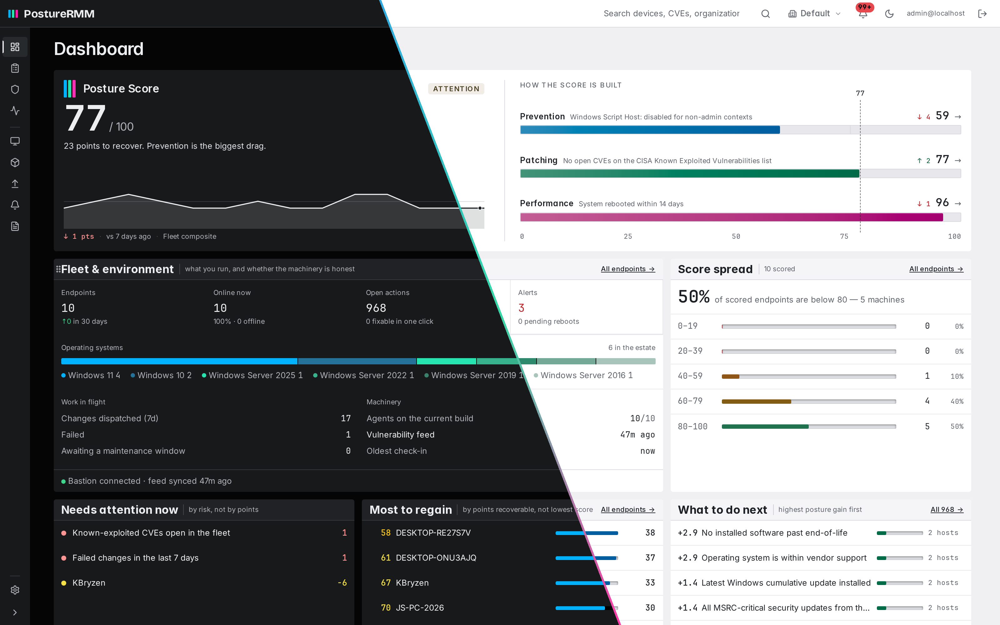

<div align="center">


**Endpoint management, security and compliance in one self-hosted platform.**

Manage, patch, deploy, remote into, harden, audit and remediate your Windows fleet —
from one console, on your own hardware, with nothing phoning home.

**Free forever up to 50 endpoints. Every feature. No asterisks.**

</div>

<div align="center">

</div>

---

## What it does

Most tools in this space stop at telling you what is wrong. PostureRMM closes the loop: it finds
the problem, fixes it, then **re-measures to prove the fix worked** — and if it didn't, it says so
rather than reporting the API call as a success.

| Area | Capabilities |
|---|---|
| **Compliance** | Audit against DISA STIG, Microsoft Security Baselines and a curated hardening profile. Failing checks carry authored fixes that apply per-endpoint, per-check across the fleet, or as "apply all safe fixes" — behind a safety gate that refuses anything which would cut your own access. Every fix is verified by re-running the check, and every fix is revertible, because each executor captures the state it overwrote. |
| **Patching** | Windows updates scanned **offline** against Microsoft's own applicability engine — no internet needed on the endpoint or the server. Third-party app updates from a curated catalogue. CVE correlation across NVD, EPSS, MSRC, CISA KEV and GHSA with version-range-aware matching. Deployment policies with canary pauses, maintenance windows and an optional supply-chain bake period. |
| **Software** | Curated app catalogue with one-click install and uninstall, custom `.msi`/`.exe`/`.msix` upload, registry-verified installs with exit-code classification and tiered retry, full software inventory, and an application blocklist for rival agents and unapproved remote-access tools. |
| **Remote access** | Browser-based remote desktop, a real terminal, file browse/upload/download, and PowerShell execution with an approval workflow and live output — no separate tool, no separate agent. |
| **Fleet** | Rule-based dynamic groups, ARP network discovery for unmanaged devices, hardware and disk-health inventory, per-endpoint reachability history, maintenance windows, reboot policies with end-user deferral, and alerting over webhook and email with delivery health you can see. |
| **Access & audit** | OIDC single sign-on — free, in every tier — five-role RBAC with group scoping, TOTP 2FA, scoped API keys, a permanent audit trail, multi-tenant data model, and a read-only "view as" lens so you can check RBAC is what you think it is. |

## The Posture Score

Three pillars, equally weighted, composing one number that drills all the way down to the check or
telemetry sample that produced it.

| Pillar | Covers |
|---|---|
| **Prevention** | DISA STIG, Microsoft Security Baseline, PostureRMM Recommended hardening, mandate crosswalks |
| **Patching** | CVE exposure, patch latency and cadence, OS and application end-of-life |
| **Performance** | Disk health and fill projection, SMART/NVMe wear, thermal throttling, battery health, reboot age, time-sync drift, service state |

Unmeasured surface **shrinks the maximum** rather than counting as failure, so a score is never a
guess dressed up as a number. An empty fleet reads "not yet established", not zero.

## What's in the box

**2,850 atomic compliance checks** across ten platforms, imported from upstream DISA SCAP/XCCDF and
the Microsoft Security Compliance Toolkit by dedicated importers — not hand-transcribed:

| Platform | Checks |
|---|---|
| Windows 11 · 10 | 577 · 496 |
| Windows Server 2022 · 2019 · 2016 · 2025 | 443 · 384 · 329 · 286 |
| Microsoft 365 Apps · Edge · Chrome · Firefox | 201 · 73 · 38 · 23 |

Plus **nine mandate crosswalks** — HIPAA, PCI DSS v4, SOC 2 CC, ISO 27001 Annex A, CMMC L1 and L2,
Cyber Essentials, cyber-insurance questionnaires and customer security questionnaires — mapping
regulatory controls back to the checks that answer them.

Checks are YAML, not code. So is every posture rule. You can read them, and so can your auditor.

## Offline by design

**The product runs with no internet at all.** Enrollment, compliance scanning, remediation, patch
installation, software deployment, remote desktop, reporting — all of it happens on your network. Your
endpoints never reach out. Neither does the backend. Even Windows Update scanning is done offline,
against Microsoft's own applicability engine, so an endpoint never contacts Microsoft either.

The internet buys exactly one thing: **fresh content.** New CVEs, patch payloads, updated
compliance baselines, the app catalogue. That arrives by *hydration* — a single component, the
Bastion, pulls from a static feed on Cloudflare R2 on a schedule you set. Open egress for a
maintenance window, let it fill up, close it again. Anything the backend asks for while the door
is shut queues durably and drains the moment it opens, with no operator action and nothing to
re-request.

Nothing goes the other way. There is no PostureRMM server that knows your fleet exists — the feed
is a file store and your Bastion downloads files. Community needs no activation and no licence
token at all; Business activates once and then never needs to reach us again.

First install and first enrollment work with the door shut too: the agent installer travels inside
the offline bundle.

## Architecture

RMM is the most abused software category there is — see [LOLRMM](https://lolrmm.io). PostureRMM is
built so it cannot become another entry on that list: your backend accepts **no inbound connection
from us**, and cannot be reached by us at all.

```
        ┌────────────────────┐
        │  PostureRMM Feed   │   threat intel, patch metadata, app catalog
        └─────────┬──────────┘
                  │ HTTPS, outbound only, on your schedule
┌─────────────────┼───────────────────────────────────────────┐
│ YOUR NETWORK    ▼                                           │
│   Bastion (Rust) ── the only component that reaches out     │
│      │                                                      │
│      ▼                                                      │
│   Backend (Rust) ── TLS edge, API, admin UI, scheduler      │
│      │              zero outbound internet                  │
│      ├── PostgreSQL                                         │
│      └── Agents (Rust) ── Windows service, no runtime deps  │
└─────────────────────────────────────────────────────────────┘
```

Run the Bastion always-on and your fleet stays current continuously; run it behind a door you open
once a month and your fleet stays current as far back as your last sync. Both are first-class —
neither is a degraded mode.

There is no cloud version to migrate you to.

## Quick Start

Docker Engine 20.10+ and Compose v2 on any Linux host. **Nothing to edit** — no values to choose,
no certificates to obtain, no DNS.

```bash
mkdir posturermm && cd posturermm
curl -LO https://github.com/PostureRMM/PostureRMM/releases/latest/download/docker-compose.yml
curl -LO https://github.com/PostureRMM/PostureRMM/releases/latest/download/preflight.sh
chmod +x preflight.sh && ./preflight.sh
```

`preflight.sh` checks the host, generates your database password, records this host's address as
the name agents will use to reach it, pulls the images and starts the stack. Then watch
`docker compose logs -f backend` for the generated `admin@localhost` password and
log in at `https://<host>/`. Add your first endpoint from **Endpoints → Install first endpoint**,
which hands you a one-line PowerShell command to run on it.

Windows endpoints supported: **11, 10, and Server 2016 / 2019 / 2022 / 2025.**

<details>
<summary><b>Air-gapped install</b></summary>

Take `posturermm-offline-vX.Y.Z.tar.gz` from the same release, carry it across however your air gap
works, then:

```bash
tar xzf posturermm-offline-vX.Y.Z.tar.gz
cd posturermm-offline-vX.Y.Z
./install.sh
./preflight.sh
```

Same stack, with `docker load` in front of the pull. `install.sh` loads the bundled images and puts
the agent installer in place; `preflight.sh` is the same script the online quickstart runs, and it
is what checks the host, generates the database password and starts the stack. The agent installer
travels inside the bundle, so first enrollment works with no internet at any point.

</details>

## Configuration

**Every setting is optional, and a default install sets none of them.** The compose file from the
release carries its own version, `preflight.sh` generates the database password, and the server
generates its login-session key, TLS certificate and internal bastion secret the first time it
starts. Read this section when you want a real hostname, a different port, your own certificate or a
split deployment — not before installing.

To set anything, put it in a file called `.env` beside `docker-compose.yml`. If `preflight.sh` has
already run it wrote one for you — **add your lines to that file** rather than replacing it, so the
generated database password survives. `env.example` on the release page is a commented starting
point. Values are read when a container starts, so run `docker compose up -d` after an edit.

### Settings most installs touch

| Setting | Default | What it does |
|---|---|---|
| `POSTURERMM_VERSION` | the version baked into your `docker-compose.yml` | Release tag to pull for the server and bastion images. |
| `POSTURERMM_DOMAIN` | this host's primary address, recorded by `preflight.sh` on first run | Hostname agents and browsers use to reach this server. A DNS name or a bare IP. Drives the certificate the server generates and the URL baked into agent install commands. Set it to a DNS name if you have one. |
| `POSTURERMM_HTTPS_PORT` | `443` | Host port HTTPS is published on. The agent install URL follows this value, so changing this one number moves both. |
| `POSTGRES_PASSWORD` | generated by `preflight.sh` on first run | Password for the `posturermm` PostgreSQL role. |
| `POSTURERMM_ENCRYPTION__MASTER_SECRET` | a shipped placeholder | Key that decrypts remediation-script content in feed bundles, read by the server. Any string; `openssl rand -hex 32` makes a good one. Set your own on any deployment you care about. |

**`POSTURERMM_VERSION` is also how you upgrade.** There is no `latest` fallback, so the stack can
never upgrade itself behind your back. A fresh install leaves it alone; to move an existing install
to a new release, set the new version and run `docker compose pull && docker compose up -d`.

**A bare IP in `POSTURERMM_DOMAIN` is fine.** Agents are unaffected — they pin the certificate — but
browsers keep warning until you import the generated CA into the browser or operating-system trust
store.

**`POSTGRES_PASSWORD` is write-once.** The database volume is initialised with whatever value is
present at the first start and PostgreSQL keeps it thereafter, so changing it later makes PostgreSQL
reject the server and the stack stays down on an authentication failure. `preflight.sh` generates it
once and never rewrites it. Set it by hand only for an externally-managed credential, and only
before the first start.

### Address, ports and TLS

| Setting | Default | What it does |
|---|---|---|
| `POSTURERMM_HTTP_PORT` | `80` | Host port for the HTTP redirect and the plaintext agent bootstrap. |
| `POSTURERMM_HTTPS_BIND` | every address | Host address HTTPS is published on. Set `127.0.0.1` when a reverse proxy on this host already owns the public port. |
| `POSTURERMM_TLS__ENABLED` | `true` | Whether the server terminates TLS itself. Set `false` only when your own TLS terminator fronts it, in which case the server serves plain HTTP on port 3000 instead. |
| `POSTURERMM_SERVER__PUBLIC_URL` | `https://<POSTURERMM_DOMAIN>:<POSTURERMM_HTTPS_PORT>` | Full URL written into agent install commands and enrollment links, and the host the generated certificate is issued for. Set it only when the URL clients use differs from the one above — behind a tunnel, a reverse proxy, or split DNS. |

**Bringing your own certificate.** Obtain it however you like — acme.sh, certbot, a commercial CA —
and put `server.crt` and `server.key` into the `posturermm-tls` volume, with no `.auto-generated`
marker file beside them. The server leaves certificates it did not generate untouched and serves
them as they are, and agents then validate against the platform trust store instead of the internal
CA. Drop both files or neither: a half-populated volume is an error at start, deliberately.

### The Bastion and the content feed

The Bastion is the only container that reaches the internet. It has no configuration file to create
and nothing is mounted into it — it runs on its built-in defaults and takes the overrides below. A
TOML file works too if you prefer one, mounted at `/app/config/bastion.toml`, but no install needs
one.

| Setting | Default | What it does |
|---|---|---|
| `POSTURERMM_BASTION__URL` | `http://bastion:8300` | URL the server uses to reach the Bastion — by default the bastion container in the same compose file, so a single-host install sets nothing. Set it only when the Bastion runs on a separate host, e.g. `https://bastion.dmz.example:8443`. |
| `POSTURERMM_BASTION__SECRET` | generated once and passed between the two containers through a shared volume | Shared secret the server and the Bastion authenticate with. Any string, as long as both sides carry the same one; `openssl rand -hex 32` makes a good one. |
| `POSTURERMM_FEED__API_URL` | `https://feed.posturermm.com` | Where the Bastion fetches content from. Set it only to point at a mirror of your own. |
| `POSTURERMM_FEED__DEPLOYMENT_ID` | empty | Fallback identifier for this deployment, sent with each feed request. Leave it unset: the server mints one on first boot and sends it, and the Bastion only falls back to this. Set it (any valid UUID) only to pin a Bastion on a separate host. |
| `POSTURERMM_FEED__TIER` | `community` | Feed channel: `community` or `pro`. |
| `POSTURERMM_FEED__SYNC_INTERVAL_HOURS` | `1` | How often the Bastion checks for new content, in hours. |

**In a split deployment the secret must match on both sides.** Running the Bastion on a separate
host — in a DMZ, say — there is no shared volume to pass it through, so generate one value and put
the **same** value in the `.env` on both hosts. The standalone bastion compose file will not start
without it.

### Keys and logging

| Setting | Default | What it does |
|---|---|---|
| `JWT_SECRET` | generated on the first start, kept in the `posturermm-data` volume | Signing key for login sessions. At least 32 characters. Set it only to rotate the key or to supply one from your own key management. |
| `POSTURERMM_CREDENTIAL_KEY` | unset | Encrypts stored credentials at rest — the ones saved for network scans and remote access — and signs evidence exports. Exactly 64 hexadecimal characters: `openssl rand -hex 32`. Unset, storing credentials stays switched off and evidence signing is unavailable. |
| `LOG_LEVEL` | `info` | Server log level: `trace`, `debug`, `info`, `warn` or `error`. |
| `RUST_LOG` | `info` | Bastion log level. Takes a level, or per-module directives such as `info,posturermm_bastion=debug`. |

Adding `POSTURERMM_CREDENTIAL_KEY` later is fine and switches the features on. Changing it after
credentials are stored makes those credentials unreadable. A malformed value does **not** stop the
server: it logs a warning and leaves both features switched off, so check the startup log after
setting it rather than assuming a clean boot means it was accepted.

### Source address in the audit log

Every audit entry records the client's address. `POSTURERMM_SERVER__TRUSTED_PROXIES` — comma-separated
IPs or CIDRs, **default empty** — names the addresses whose `X-Forwarded-For` and `X-Real-Ip` headers
the server believes when it writes that column.

Empty is the safe default: the server records the address that actually connected and ignores
forwarding headers, so a client talking straight to it cannot write an address of its own choosing
into your audit log. Running this compose stack as shipped, leave it empty. Set it only when your
own reverse proxy fronts the server, and set it to that proxy's address — forget to, and every audit
entry records the proxy instead of the client. That mistake is wrong but visible. The reverse one,
believing a header from an address that is not a proxy, is invisible, which is why it is not the
default.

### Mirroring the images

`POSTURERMM_REGISTRY_OWNER` (default `posturermm`) is the registry namespace the images come from.
The default namespace is public and needs no `docker login`. Set it only if you mirror the images
into a namespace of your own.

`NVD_API_KEY` and `GITHUB_TOKEN` are not settings for this stack. The server never calls NVD or
GitHub directly — vulnerability and application data arrive as prepared content through the Bastion.

## Pricing

**Free, forever, up to 50 endpoints — with every feature above.** Not a trial, not a
feature-limited edition, not "free for personal use". SSO, the full posture model, all compliance
content, remote access and every report are in it.

A paid tier for larger fleets arrives in **2027**, once the free one has had real time in the
field. It will raise the endpoint cap and change nothing else — your first 50 stay free at any
scale, and there will be no feature matrix, because there are no features to withhold.

## Support and downloads

Everything is here on GitHub for now — there is no support portal, no ticket system, and no
separate download site.

- [**Discussions**](https://github.com/PostureRMM/PostureRMM/discussions) — questions, how-tos,
  anything you would otherwise ask a colleague
- [**Issues**](https://github.com/PostureRMM/PostureRMM/issues) — bugs and feature requests
- [**Releases**](https://github.com/PostureRMM/PostureRMM/releases) — every download: the compose
  file, the preflight script, the offline bundle, the agent installers
- [**Security policy**](SECURITY.md) — report a vulnerability here, never as a public issue

## License

Proprietary — see [LICENSE](LICENSE). Free and perpetual up to 50 endpoints, no redistribution or
rebranding of our builds. It is short and written to be read.
